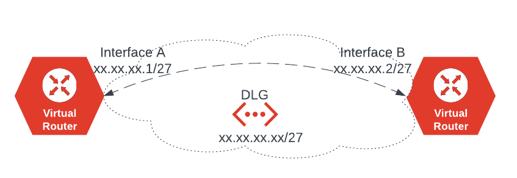
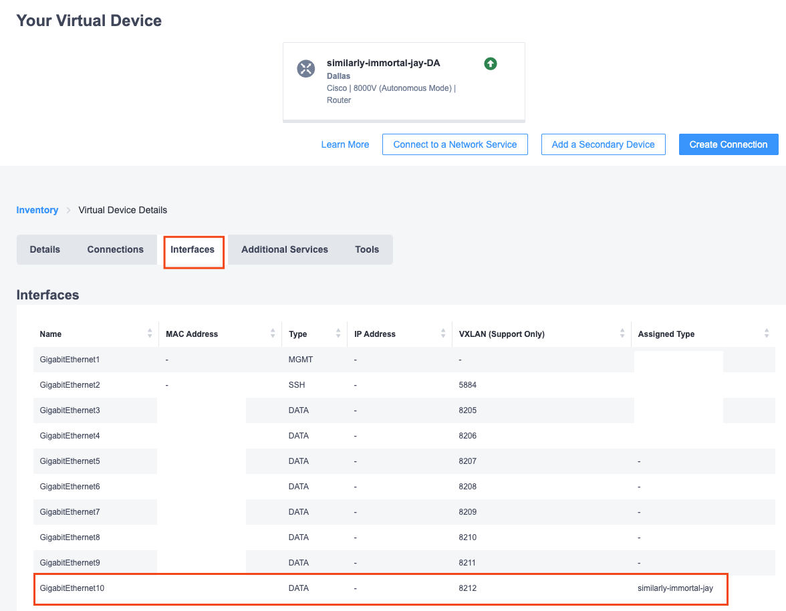

Connecting Network Edge with device link example

# Pre-requirement

- [Equinix account](https://developer.equinix.com/)
- [Equinix Metal account](https://console.equinix.com) 
- [Terraform](https://www.terraform.io/) 

# Usage

clone the repository
```bash
git clone git@github.com:eqix-use-cases/equinix-ne-device-link.git
cd equinix-ne-device-link
```

you will have to edit the file `terraform.tfvars` according to your configuration


create infrastructure
```bash
terraform init
terraform apply
```

# Architecture diagram

The high level of the infrastructure will look like in the following diagram. For the additional use cases why you need to use Device Links between Network Edge, please check the [documentation](https://docs.equinix.com/en-us/Content/Interconnection/NE/user-guide/NE-device-linking-pending.htm). 



# Additional configuration
The code will provision the infrastructure - two [Network Edge](https://www.equinix.com/products/digital-infrastructure-services/network-edge) devices and [device link](https://docs.equinix.com/en-us/Content/Interconnection/NE/user-guide/NE-device-linking-pending.htm) between them.

some additional configuration will have to be done to enable communication between devices.

- check the device details information, under the `Interfaces` tab which interface the device link has been attached (see the screenshot below)


### login to the device to configure the interface

```
conf t
int GigabitEthernet10
ip address 172.16.100.1 255.255.255.224
no shut
```

### do the same for the second device. login and configure interface on the second device (assume it's interface 9)

```
conf t
int GigabitEthernet9
ip address 172.16.100.2 255.255.255.224
no shut
exit
```

## Testing the results 

result should be similar to


### first 

```
similarly-immortal-jay-da#ping 172.16.100.2
Type escape sequence to abort.
Sending 5, 100-byte ICMP Echos to 172.16.100.2, timeout is 2 seconds:
!!!!!
Success rate is 100 percent (5/5), round-trip min/avg/max = 29/29/29 ms
```

### second 
```
similarly-immortal-jay-dc#ping 172.16.100.1
Type escape sequence to abort.
Sending 5, 100-byte ICMP Echos to 172.16.100.1, timeout is 2 seconds:
!!!!!
Success rate is 100 percent (5/5), round-trip min/avg/max = 28/28/29 ms
```